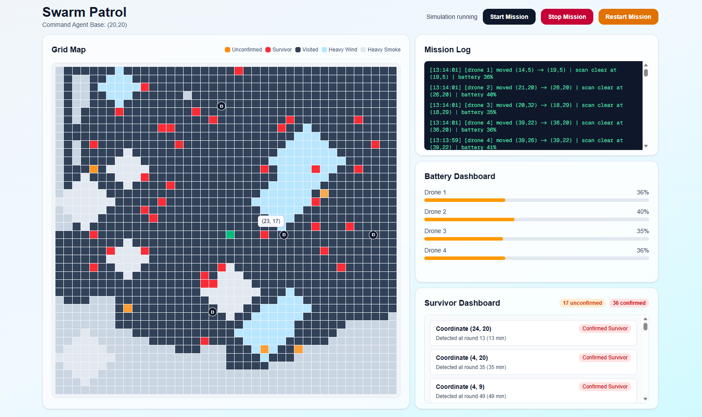
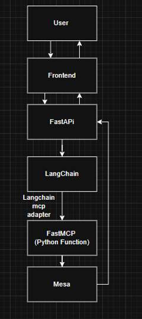

# Swarm Patrol 


The ASEAN region is highly vulnerable to super typhoons and earthquakes. These disasters often cause catastrophic terrestrial communication failures in the critical first 72 hours, rendering cloud-dependent AI models useless. Because current rescue models rely on centralized, high-bandwidth cloud connectivity, they fail when infrastructure collapses.

## The Objective
Participants are challenged to build a "self-healing" rescue swarm that operates as a collective brain at the edge. The goal is to develop an Autonomous Command Agent capable of orchestrating a fleet of rescue drones to map zones and detect survivors without cloud access or human pilots.

## __Feature/Function__  
### •	**The Map:**   
The search area is represented as a 40 x 40 grid cell.

### •	**The Actors:**  
A "Command Agent" powered by an LLM sits at the origin (20,20). It deploys 4 drones at the same time.  

### •	**Time Mechanics:**   
The simulation or real-world logic operates in turns, proposing "1 minutes as one round". In each round, each drone can move one step and perform thermal scan.  

### •	**Battery Drain:**   
Moving one step or 1 minute consumes 1% of a drone's battery. Charging a drone takes 20 minutes.  

### •	**Exploration Logic:**  
As drones move, they mark grid cells as "visited" as dark grey block, "unconfirmed" as orange block, "Confirmed Survivor" as red block. The notes explicitly mention using a A* algorithm to handle this grid traversal.  

### •	**Swarm Intelligence:**   
Drones utilize "shared memory." When one drone maps an area or finds an obstacle, other drones instantly update their own pathfinding logic based on that shared data.  

### •	**Survivor Verification:**   
To avoid false alarms, the drone uses multimodal inputs (temperature, sound, shape) to autonomously determine if it has actually found a survivor. Might have a chance of being a false alarm  

### •	**Routing for Humans:**  
Once a survivor is confirmed, the AI analyzes the grid to plot a safe, optimal route for human rescue teams to follow with using the A* algorithm.  

## Run 
- Open frontend and backend in different terminal.
### Frontend 
```
npm install
```
```
npm run dev
```
### Backend
```
cd backend
```
```
uvicorn main:app --host 0.0.0.0 --port 8000
```
 

## __Tech Stack:__    
•	Next.js   
•	Mesa  
•	NumPy & Pandas  
•	NetworkX  
•	FastMCP  
•	FastAPI  
•	LangChain  



## __Future Roadmap:__
•	**Risk Management:** The system accounts for "rescue priority" triage and handles edge cases like drone hardware failures. 

•	**Dynamic Routing:** The system introduces random environmental hazards like strong winds or bird flocks. The onboard LLM allows the drone to autonomously recalculate and change its route to avoid these.  

•	**Signal Attenuation:** Every grid space away from the Command Agent causes a 5% drop in signal strength. Drones must switch modes to act as "signal extensions" (relays) for each other to reach further into the grid

---

> [!NOTE]
> This case study is under the Agentic AI (Decentralised Swarm Intelligence) track. It aligns with Sustainable Development Goals 9 (Industry, Innovation, and Infrastructure) and 3 (Good Health and Well-being).
